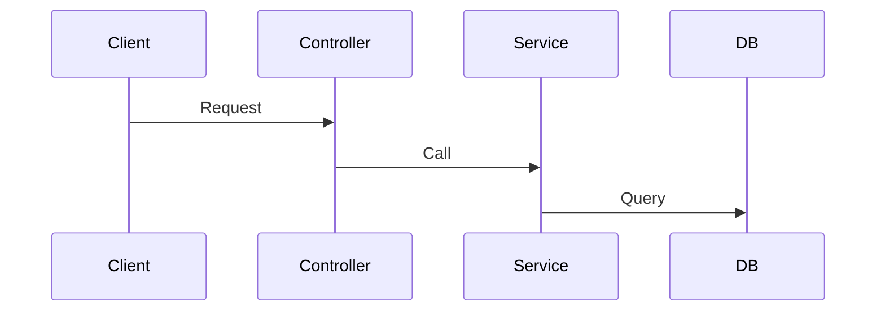

# MangoJS Artifact Management Guide

> **Purpose**: Defines all artifacts that AI agents must create or update when building MangoJS services.

---

## 📋 Artifact Categories

1. **Database Artifacts** - Schema, models, migrations
2. **API Artifacts** - OpenAPI, endpoints, examples
3. **Architecture Artifacts** - Data flow, components, DI
4. **Documentation Artifacts** - Types, errors, guides

---

## 1. 🗄️ Database Artifacts

---

### 1.1 Database Conceptual Model

**File**: `docs/database/conceptual-model.marmeid`

**Contains**: Business entities, domain rules, terminology

**Update When**: Adding business entities or rule changes

**Constrains**:

- Do not add table fields and type
- Keep only Entity name, if necessary add a short description
- All entities must below to a Domain

**Example**:

```marmeid
---
config:
  layout: elk
---
flowchart TD
    subgraph Domain1 [Domain 1]
      A[Entity 1] -->|has| B(fa:fa-car Entity 2)
    end
    subgraph Domain2 [Domain 2]
      C[Entity 5] -->|One| D[fa:fa-car Entity 3]
      C -->|Two| E[fa:fa-car Entity 4]
      C -->|Three| F[fa:fa-car Entity 6]
    end
```

---

### 1.2 Database Physical Model

**File**: `docs/database/physical-model.marmeid`

**Contains**: Tables, columns, types, constraints, indexes

**Update When**: Creating migrations or schema changes

**Example**:

```marmeid
---
config:
  layout: elk
---
erDiagram
    MULTIMEDIA_FILES {
        uuid id PK
        varchar filename
        varchar storagePath UK
        varchar storageUrl
        varchar mimeType
        bigint fileSize
        varchar format
        uuid uploadedBy FK
        jsonb metadata
        enum status
        timestamp deletedAt
        timestamp createdAt
        timestamp updatedAt
    }

    EXTERNAL_USER {
        uuid id PK
        string reference
    }

    MULTIMEDIA_FILES }o--|| EXTERNAL_USER : "uploaded by"
```

---

## 3. 🌐 API Artifacts

### 3.1 OpenAPI Specification

**File**: `docs/api/openapi.json` or `openapi.yaml`

**Contains**: Complete API contract (endpoints, schemas, auth)

**Update When**: Adding/modifying endpoints or schemas

**Required**: All endpoints, request/response schemas, error codes

---

## 4. 🏗️ Architecture Artifacts

### 4.1 Data Flow Diagram

**File**: `docs/architecture/data-flow.mermaid`

**Contains**: Request-to-response flow through all layers

**Update When**: Adding endpoints or modifying flow

**Example**:



---

### 4.2 Component Architecture

**File**: `docs/architecture/components.mermaid`

**Contains**: System components, dependencies, external services

**Update When**: Adding services or integrations

---

## 5. 📖 Documentation Artifacts

### 5.1 Type System Documentation

**File**: `docs/types/type-system.md`

**Contains**: Entity types, DTOs, API types, enums

**Update When**: Adding/modifying types

**Constraints**:

- List entities in a table
- Only add a short file description and the type table

**Template**:

````markdown
### table_name

| Entity | Type Name | Description                    | File                              |
| ------ | --------- | ------------------------------ | --------------------------------- |
| User   | User      | Full user entity from database | `src/types/entities/user.type.ts` |
| User   | UserPost  | DTO for creating new users     | `src/types/entities/user.type.ts` |

---

### 5.2 Error Catalog

**File**: `docs/errors/error-catalog.md`

**Contains**: All error codes, messages, causes, resolutions

**Update When**: Adding error scenarios

**Constraints**:

- List errors in a table grouped by HTTP status code
- Only add a short description and the error table

**Template**:

```markdown
### HTTP Status Code

| HTTP Error Code | Error Code         | Error Name           | Message                                  | Cause                             | Resolution                  |
| --------------- | ------------------ | -------------------- | ---------------------------------------- | --------------------------------- | --------------------------- |
| 400             | ERR_INVALID_EMAIL  | Invalid Email Format | "Invalid email format: {email}"          | Email doesn't match regex pattern | Provide valid email address |
| 400             | ERR_PASSWORD_SHORT | Password Too Short   | "Password must be at least 8 characters" | Password length < 8               | Provide longer password     |
```

---

## 🔄 Update Workflows

### Adding New Entity

**Update These Artifacts**:

- [ ] Conceptual Model (`docs/database/conceptual-model.mermaid`)
- [ ] Physical Model (`docs/database/physical-model.mermaid`)
- [ ] Type System Documentation (`docs/types/type-system.md`)
- [ ] OpenAPI Spec (`docs/api/openapi.json`)
- [ ] Data Flow Diagram (`docs/architecture/data-flow.mermaid`)
- [ ] Error Catalog (`docs/errors/error-catalog.md`)

---

### Adding New Endpoint

**Update These Artifacts**:

- [ ] OpenAPI Spec (`docs/api/openapi.json`)
- [ ] Data Flow Diagram (`docs/architecture/data-flow.mermaid`)
- [ ] Error Catalog (`docs/errors/error-catalog.md`)

---

### Modifying Business Logic

**Update These Artifacts**:

- [ ] Error Catalog (if errors change) (`docs/errors/error-catalog.md`)
- [ ] Data Flow Diagram (if flow changes) (`docs/architecture/data-flow.mermaid`)

---

## 📂 Directory Structure

```
docs/
├── database/
│   ├── erd.mermaid
│   ├── conceptual-model.md
│   ├── physical-model.md
│   └── migration-history.md
├── services/
│   ├── dependency-map.mermaid
│   └── business-logic.md
├── api/
│   ├── openapi.json
│   ├── CHANGELOG.md
│   └── examples.md
├── architecture/
│   ├── data-flow.mermaid
│   ├── components.mermaid
│   └── di-container.md
├── types/
│   └── type-system.md
└── errors/
    └── error-catalog.md
```

---

## 🎯 AI Agent Checklist

Before completing any task:

- ✅ All required artifacts updated
- ✅ Diagrams reflect current state
- ✅ Examples tested and working
- ✅ OpenAPI matches implementation
- ✅ Types match actual code
- ✅ Errors documented

---

## 📝 Quick Reference

**Use Mermaid for**: ERD, dependency maps, flows, architecture
**Version everything**: Migrations, API changes, breaking changes
**Cross-reference**: Link related artifacts
**Keep current**: Update artifacts with code changes
**Be consistent**: Follow templates and examples
````
